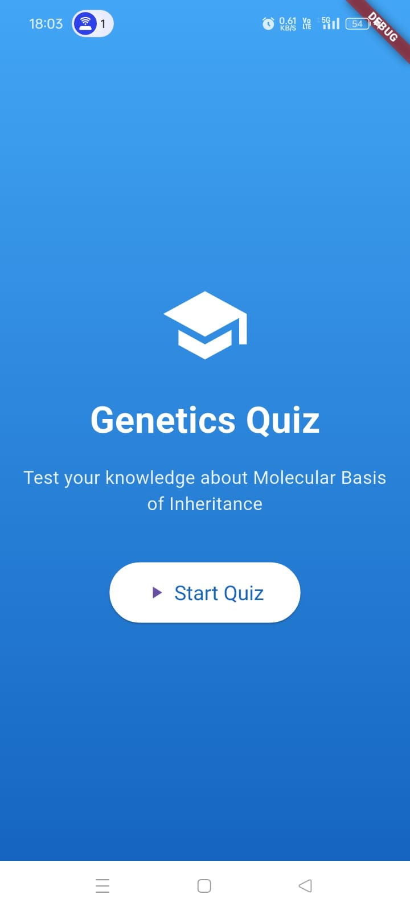
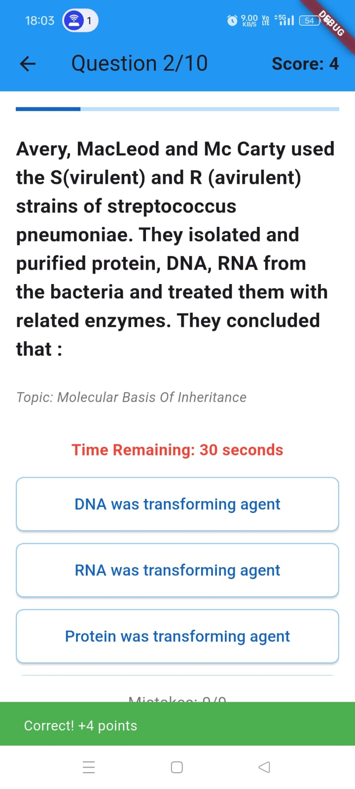
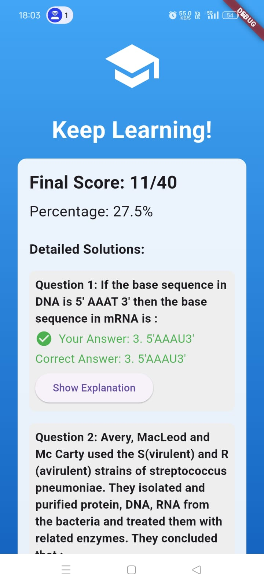

# Quiz App 🎮📚

An interactive and gamified quiz application built using Flutter, designed for engaging learning experiences. The app features a responsive design, fetches questions dynamically from an API, and includes intuitive screens to enhance the user experience.

---

## Features ✨

- Dynamic question fetching from API.
- Gamified interface with progress tracking.
- Result screen showcasing correct and incorrect answers with explanations.
- Fully responsive design for both mobile and web platforms.

---

## Screenshots 🖼️

### 1. Home Screen  
  

### 2. Quiz Screen  
  

### 3. Result Screen  
  

---

## Installation 📥

To run this application locally:  

1. **Clone the repository:**  
   ```bash
   git clone https://github.com/CodeEternity01/testline_assignment.git
   cd testline_assignment/quiz_app
Install dependencies:

bash
Copy
Edit
flutter pub get
Run the app:

bash
Copy
Edit
flutter run
Demo 🎥
Watch the demo video: Click Here

Usage 🛠️
Home Screen: Displays the welcome message and a "Start Quiz" button.
Quiz Screen: Navigate through questions, selecting answers for each.
Result Screen: View your score, correct/incorrect answers, and detailed explanations.
Requirements 🧩
Flutter SDK v3.0.0 or above
Dart SDK v2.17.0 or above
Folder Structure 📂
plaintext
Copy
Edit
quiz_app/
│
├── assets/                  # Static assets
│   └── images/              # App screenshots and icons
│
├── lib/                     # Main source code
│   ├── models/              # Data models
│   ├── screens/             # App screens
│   ├── services/            # API services
│   └── main.dart            # App entry point
│
├── pubspec.yaml             # Dependencies and assets definition
└── README.md                # Project documentation
Contributing 🤝
Contributions are welcome! Please fork the repository, create a feature branch, and submit a pull request.

License 📜
This project is licensed under the MIT License.

Author 👤
Rahul Meena

GitHub: CodeEternity01
LinkedIn: inkedin.com/in/rahul-meena-2a3a0b277/

> Replace `<https://drive.google.com/file/d/1EW67u8M9ak302htuYRNT8tki_YeFrtme/view?usp=drivesdk>` with the actual link to your demo video.
